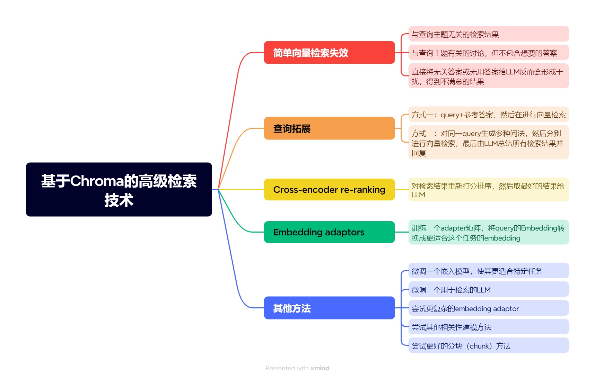

# 7. その他の技術

embeddingベースの検索技術は依然として非常に活発な研究分野であり、この授業で学んだいくつかの方案に加えて、検索効果の向上を試みることができる他の方法もあります。例えば：

- embeddingモデルのファインチューニング
- 検索用LLMのファインチューニング
- より複雑なembedding adaptorの試行
- その他の関連性モデリング手法の試行
- より良いチャンク（chunk）方法の試行

## コース総括

以上がこの授業のすべての内容です。すべての内容を完了されたことをおめでとうございます！

