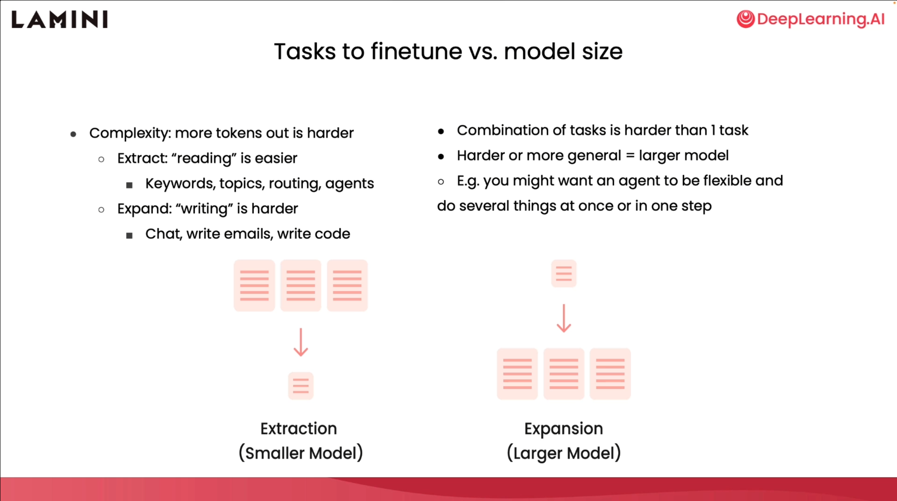

# 第8章 入門に関する注意事項

さて、最後のレッスンを終えたので、これから入門に関する注意事項、実用的なヒント、そしてより高度な訓練手法をいくつか紹介します。

## ファインチューニングの使用ステップ

ファインチューニングの実用的なステップから始めましょう。

概括して言うと、まず自分のタスクを明確にし、タスクの入力と出力に関連するデータを収集し、構造化します。十分なデータがない場合も問題ありません。データを生成するか、プロンプトテンプレートを使用してより多くのデータを作成するだけです。最初は小さなモデルをファインチューニングする必要があります。4億から10億パラメータのモデルを使用して、そのモデルの性能を理解することをお勧めします。モデルの実際のデータ量を変更して、どれだけのデータがモデルの方向性に影響するかを理解すべきです。その後、モデルを評価して、どこがうまくいき、どこがうまくいかないかを確認できます。最後に、より多くのデータを収集し、評価を通じてモデルを改善します。

これを基に、今度はタスクの複雑さを増すことができ、これによりタスクをより困難にすることができます。そして、より複雑なタスクでの性能を向上させるために、モデルのサイズを大きくすることもできます。

## タスクファインチューニング

タスクファインチューニングについて、読み取りタスクと書き込みタスクについて学びました。書き込みタスクははるかに困難で、これらのタスクの範囲はより広く、チャット、メール作成、コード作成などがあります。これは、モデルがより多くのトークンを生成するためです。したがって、モデルにとってこれはより困難なタスクです。より困難なタスクには通常、より大きなモデルが必要です。

もう一つのより困難なタスクは、タスクの組み合わせで、モデルに一つのタスクだけでなく一連の作業を行うことを要求します。これは、エージェントに複数のことを柔軟に同時に行わせるか、多段階ではなく一段階だけ行わせることを意味する可能性があります。

## モデルサイズと計算リソース

今、タスクの複雑さに必要なモデルサイズについてある程度理解し、基本的にモデルを実行するために必要なハードウェア面での計算要件も把握しました。

以前実行したプログラムでは、CPU で実行された7000万パラメータモデルを見ました。これらは最良のモデルではないので、性能の良いモデルから始めることをお勧めします。

そのため、この表の最初の行を見ると、[AWS](https://aws.amazon.com/) や他のクラウドプラットフォームで使用できる v100 GPU を取り上げたいと思います。16ギガバイトのメモリを持ち、これは推論用に70億パラメータモデルを実行できることを意味します。

しかし、訓練に関しては、訓練には勾配とオプティマイザーを保存するためにより多くのメモリが必要なため、実際には10億パラメータモデルしか適合できません。より大きなモデルを適合させたい場合は、ここで他のオプションを見ることができます。

## パラメータ効率的ファインチューニング

良いですが、これでも十分でなく、より大きなモデルを扱いたいと思うかもしれません。[PEFT](https://arxiv.org/abs/2303.15647) またはパラメータ効率的ファインチューニングと呼ばれる方法があり、これはこれを実現するのに役立つ異なる手法のセットです。パラメータを使用し、モデルを訓練する過程でより効率的です。

私が非常に気に入っている手法の一つは LORA で、これは低ランク適応を表します。

LORA の効果は、訓練が必要なパラメータと重みを大幅に削減できることです。GPT-3 を例に取ると、彼らは10,000倍削減できることを発見し、これにより GPU に必要なメモリが3倍削減されました。ファインチューニングの精度はわずかに低いものの、これは依然としてはるかに効率的な方法であり、最終的な推論遅延も同じです。では LORA は実際にはどのようなものでしょうか？実際には、事前訓練された主要な重みを凍結しながら、モデルの特定の層で新しい重みを訓練しています。したがって、これらの重みは全て凍結され、これらの新しいオレンジ色の重みがあります。これが LORA 重みです。新しい重みは少し数学的で、元の重み変化のランク分解行列です。

しかし重要なのは数学ではなく、これらの重みを訓練できることです。重要なのは、これらの重みを単独で訓練し、事前訓練された重みと交替で使用し、推論時にそれらを主要な事前訓練重みに統合して、より効率的にファインチューニングされたモデルを得ることができることです。私は LORA の使用に非常に興奮しています。なぜなら、それは新しいタスクに適応できるからです。これは、LORA を使って一つのクライアントのデータでモデルを訓練し、別のクライアントのデータで別のモデルを訓練し、必要に応じてそれらを推論に個別に統合できることを意味します。