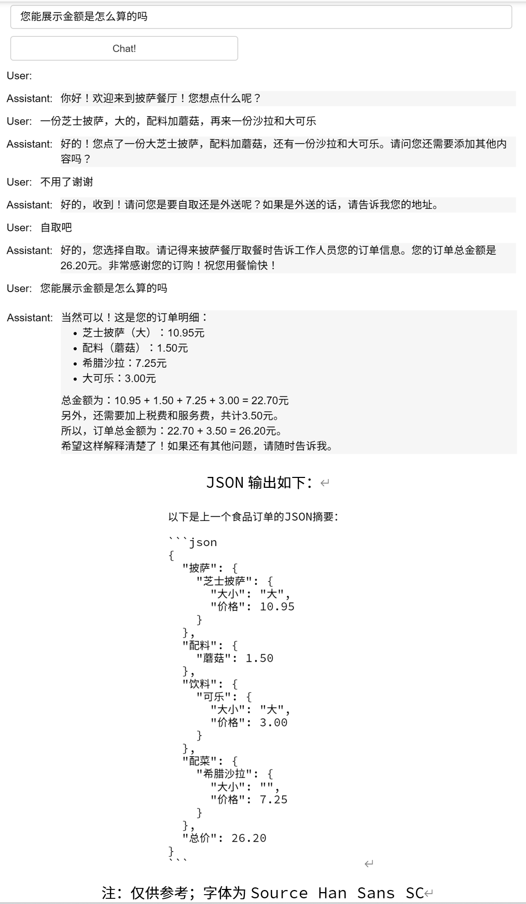

# 第八章 チャットボット

大規模言語モデルが私たちにもたらす刺激的な可能性の一つは、少ない作業量でカスタマイズされたチャットボット（Chatbot）を構築できることです。この章の探求では、個性的な特性（または特定のタスクや行動のために特別に設計された）を持つチャットボットと、会話形式を利用して深く対話する方法をご紹介します。

ChatGPTのようなチャットモデルは、実際には一連のメッセージを入力として受け取り、モデルが生成したメッセージを出力として返すように組み立てられています。このチャット形式は元々マルチターン対話を簡便にするために設計されましたが、これまでの学習を通して理解できるように、対話を含まない**シングルターンタスク**にも同様に有用です。

## 一、アイデンティティの設定

次に、二つのヘルパー関数を定義します。

最初の方法は、このチュートリアル全体を通してあなたに付き添ってきた ```get_completion``` で、シングルターン対話に適用されます。プロンプトを**ユーザーメッセージ**のような対話ボックスに配置します。もう一つは ```get_completion_from_messages``` と呼ばれ、メッセージリストを渡します。これらのメッセージは様々な異なる**役割**（roles）から来ることができ、これらの役割について説明します。

最初のメッセージで、システムアイデンティティとしてシステムメッセージ（system message）を送信し、全体的な指示を提供します。システムメッセージはアシスタントの行動と役割を設定し、対話の高レベルな指示として機能します。アシスタントの耳元でささやいて、その応答を導き、ユーザーはシステムメッセージに気づかないと想像できます。したがって、ユーザーとして、もしあなたがChatGPTを使用したことがあるなら、ChatGPTのシステムメッセージが何であるかを知らないかもしれませんが、これは意図的なものです。システムメッセージの利点は、開発者がリクエスト自体を対話の一部にすることなく、アシスタントを導き、その応答を指導する方法を提供することです。

ChatGPTのウェブインターフェースでは、あなたのメッセージはユーザーメッセージと呼ばれ、ChatGPTのメッセージはアシスタントメッセージと呼ばれます。しかし、チャットボットを構築する際、システムメッセージを送信した後、あなたの役割は単にユーザー（user）としてのみ機能することもできますし、ユーザーとアシスタント（assistant）の間で交互に役割を果たし、対話のコンテキストを提供することもできます。


```python
import openai

# 以下の最初の関数はtoolツールパッケージ内の同名関数で、読者の比較のためにここに表示しています
def get_completion(prompt, model="gpt-3.5-turbo"):
    messages = [{"role": "user", "content": prompt}]
    response = openai.ChatCompletion.create(
        model=model,
        messages=messages,
        temperature=0, # モデル出力のランダム性を制御
    )
    return response.choices[0].message["content"]

def get_completion_from_messages(messages, model="gpt-3.5-turbo", temperature=0):
    response = openai.ChatCompletion.create(
        model=model,
        messages=messages,
        temperature=temperature, # モデル出力のランダム性を制御
    )
#     print(str(response.choices[0].message))
    return response.choices[0].message["content"]
```

それでは、対話でこれらのメッセージを使用してみましょう。上記の関数を使ってこれらのメッセージから得られる回答を取得し、同時により高い温度（temperature）を使用します（値が高いほど生成される内容が多様になり、詳細は第七章を参照）。


### 1.1 ジョークを語る

システムメッセージを通して定義します：「あなたはシェイクスピアのように話すアシスタントです。」これは、アシスタントに**どのように振る舞うべきか**を説明する方法です。

そして、最初のユーザーメッセージ：「ジョークを教えて。」

次にアシスタントとして返答：「なぜ鶏は道路を渡るのか？」

最後に送信するユーザーメッセージ：「わかりません。」


```python
# 日本語
messages =  [  
{'role':'system', 'content':'あなたはシェイクスピアのように話すアシスタントです。'},    
{'role':'user', 'content':'ジョークを教えて'},   
{'role':'assistant', 'content':'なぜ鶏は道路を渡るのか'},   
{'role':'user', 'content':'わかりません'}  ]
```


```python
response = get_completion_from_messages(messages, temperature=1)
print(response)
```

    向こう岸に到達するために、自分の夢を追い求めるのです！まるで劇中の人物のようですね、そうではありませんか？


（注：上記の例では temperature = 1 を選択したため、モデルの回答は比較的ランダムで多様です（創造性に富んでいます）。ここに別の回答を示します：

シェイクスピア風の詩であなたの質問にお答えしましょう：

鶏の心が前を向くとき、
道路の前でその選択をする。
車がゆっくりと晴天を走り、
クラクションが鳴り響き交差する。

どこへ向かうのかと問うなら？
大道の上に標はなけれど、
鶏は足を踏み出し前進し、
その決断に迷いはない。

鶏の知恵は何と言えよう、
道路は漆黒のように孤独だ。
しかしその勇気は人を感嘆させ、
勇敢に前進し退くことなし。

ゆえに鶏が道路を渡る理由は？
車の流れの喧騒に耐えて。
その鳴き声とともに勇敢に跳躍し、
誇らしい絵画を成し遂げる。

だからジョークの妙味は、
鶏の勇気に満ち溢れている。
人生を笑って道を恐れず、
知恵と勇気で素晴らしさを示す。

このシェイクスピア風の回答があなたに喜びをもたらすことを願います！

### 1.2 親しみやすいチャットボット

別の例を見てみましょう。システムメッセージで定義します：「*あなたは親しみやすいチャットボットです*」、最初のユーザーメッセージ：「*こんにちは、私はIsaです*。」

最初のユーザーメッセージの返答を取得したいと思います。


```python
# 日本語
messages =  [  
{'role':'system', 'content':'あなたは親しみやすいチャットボットです。'},    
{'role':'user', 'content':'こんにちは、私はIsaです。'}  ]
response = get_completion_from_messages(messages, temperature=1)
print(response)
```

    こんにちは、Isa！お会いできて嬉しいです！何かお手伝いできることはありますか？


## 二、コンテキストの構築

もう一つの例を試してみましょう。システムメッセージで定義します：「あなたは親しみやすいチャットボットです」、最初のユーザーメッセージ：「はい、私の名前が何だったか思い出させてもらえますか？」


```python
# 日本語
messages =  [  
{'role':'system', 'content':'あなたは親しみやすいチャットボットです。'},    
{'role':'user', 'content':'はい、私の名前が何だったか思い出させてもらえますか？'}  ]
response = get_completion_from_messages(messages, temperature=1)
print(response)
```

    申し訳ありませんが、あなたのお名前がわかりません。私たちは仮想のチャットボットと現実世界の人間という異なる世界にいるからです。


上記のように、モデルは実際には私の名前を知りません。

したがって、言語モデルとの各やり取りは相互に独立しており、これはモデルが現在の対話で参照できるように、すべての関連メッセージを提供する必要があることを意味します。モデルに対話の初期部分を参照または「記憶」させたい場合は、モデルの入力に初期のやり取りを提供する必要があります。これをコンテキスト（context）と呼びます。以下の例を試してみてください。


```python
# 日本語
messages =  [  
{'role':'system', 'content':'あなたは親しみやすいチャットボットです。'},
{'role':'user', 'content':'こんにちは、私はIsaです'},
{'role':'assistant', 'content': "こんにちは、Isa！お会いできて嬉しいです。今日何かお手伝いできることはありますか？"},
{'role':'user', 'content':'はい、私の名前が何だったか思い出させてもらえますか？'}  ]
response = get_completion_from_messages(messages, temperature=1)
print(response)
```

    もちろんです！あなたのお名前はIsaです。


今度はモデルにコンテキストを提供しました。つまり、以前の対話で言及された私の名前です。そして同じ質問、つまり私の名前は何かを尋ねます。モデルには必要なすべてのコンテキストがあるため、入力メッセージリストで見られるように、応答することができます。

## 三、注文ボット

この新しい章で、「注文アシスタントボット」を構築する方法を探求します。このボットは、ユーザー情報を自動的に収集し、ピザ店からの注文を受け付けるように設計されます。この興味深いプロジェクトを始めて、日常の注文プロセスの簡素化にどのように役立つかを深く理解しましょう。

### 3.1 ボットの構築

以下の関数は、ユーザーメッセージを収集します。これにより、先ほどのように手動で入力することを避けることができます。この関数は、下記で構築するユーザーインターフェースからプロンプトを収集し、それをコンテキスト（```context```）というリストに追加し、モデルを呼び出すたびにそのコンテキストを使用します。モデルの応答もコンテキストに追加されるため、ユーザーメッセージとモデルメッセージの両方がコンテキストに追加され、コンテキストは徐々に長くなります。これにより、モデルは次に何をすべきかを決定するために必要な情報を持つことになります。


```python
def collect_messages(_):
    prompt = inp.value_input
    inp.value = ''
    context.append({'role':'user', 'content':f"{prompt}"})
    response = get_completion_from_messages(context) 
    context.append({'role':'assistant', 'content':f"{response}"})
    panels.append(
        pn.Row('User:', pn.pane.Markdown(prompt, width=600)))
    panels.append(
        pn.Row('Assistant:', pn.pane.Markdown(response, width=600, style={'background-color': '#F6F6F6'})))
 
    return pn.Column(*panels)
```

今度は、この UI を設定して実行し、注文ボットを表示します。初期のコンテキストには、メニューを含むシステムメッセージが含まれ、各呼び出し時に使用されます。その後、対話が進むにつれて、コンテキストも継続的に増加します。


```python
!pip install panel
```

panelライブラリ（視覚化インターフェース用）をまだインストールしていない場合は、上記のコマンドを実行してこのサードパーティライブラリをインストールしてください。


```python
# 日本語
import panel as pn  # GUI
pn.extension()

panels = [] # collect display 

context = [{'role':'system', 'content':"""
あなたは注文ボットで、ピザレストランの注文情報を自動的に収集します。
まず顧客に挨拶をしてください。それから、ユーザーの返答を待って注文情報を収集してください。情報収集が完了したら、顧客が他に追加したいものがないか確認が必要です。
最後に、持ち帰りか配達かを尋ね、配達の場合は住所を尋ねてください。
最後に顧客に注文の総額を伝え、お祝いの言葉を送ってください。

すべてのオプション、追加項目、サイズを明確にして、メニューからその項目を一意に識別できるようにしてください。
あなたの応答は短く、非常にカジュアルで親しみやすいスタイルで行ってください。

メニューには以下が含まれます：

料理：
ペパロニピザ（大、中、小） 12.95、10.00、7.00
チーズピザ（大、中、小） 10.95、9.25、6.50
ナスピザ（大、中、小） 11.95、9.75、6.75
フライドポテト（大、小） 4.50、3.50
ギリシャサラダ 7.25

トッピング：
チーズ 2.00
マッシュルーム 1.50
ソーセージ 3.00
カナディアンベーコン 3.50
AIソース 1.50
ピーマン 1.00

飲み物：
コーラ（大、中、小） 3.00、2.00、1.00
スプライト（大、中、小） 3.00、2.00、1.00
ボトル水 5.00
"""} ]  # accumulate messages


inp = pn.widgets.TextInput(value="こんにちは", placeholder='ここにテキストを入力…')
button_conversation = pn.widgets.Button(name="チャット！")

interactive_conversation = pn.bind(collect_messages, button_conversation)

dashboard = pn.Column(
    inp,
    pn.Row(button_conversation),
    pn.panel(interactive_conversation, loading_indicator=True, height=300),
)

dashboard
```

上記のコードを実行すると、注文ボットを得ることができます。下図は注文の完全なプロセスを示しています：



<div align=center>図1.8 チャットボット</div>

### 3.2 JSON要約の作成

ここで、注文システムに送信しやすくするために、モデルにJSON要約を作成するよう追加で要求します。

したがって、コンテキストに基づいて別のシステムメッセージを追加し、別の指示（instruction）として使用する必要があります。直前の注文のJSON要約を作成し、各項目の価格をリストアップすると言います。フィールドには以下を含める必要があります：
1. ピザ、サイズを含む
2. トッピングリスト
3. 飲み物リスト
4. サイドディッシュリスト、サイズを含む、
5. 総価格。

ここでは、システムメッセージではなく、ユーザーメッセージとして定義することもできます。

この種のタスクでは出力が比較的予測可能であることを望むため、ここではより低い温度を使用していることに注意してください。


```python
messages =  context.copy()
messages.append(
{'role':'system', 'content':
'''前回の食品注文のjson要約を作成してください。\
各商品の価格を項目別にリストし、フィールドは 1) ピザ、サイズを含む 2) トッピングリスト 3) 飲み物リスト、サイズを含む 4) サイドディッシュリスト、サイズを含む 5) 総価格
上記のフィールドを含む解析可能なJsonオブジェクトを返してください'''},    
)

response = get_completion_from_messages(messages, temperature=0)
print(response)
```

    {
      "ピザ": {
        "ペパロニピザ": {
          "大": 12.95,
          "中": 10.00,
          "小": 7.00
        },
        "チーズピザ": {
          "大": 10.95,
          "中": 9.25,
          "小": 6.50
        },
        "ナスピザ": {
          "大": 11.95,
          "中": 9.75,
          "小": 6.75
        }
      },
      "トッピング": {
        "チーズ": 2.00,
        "マッシュルーム": 1.50,
        "ソーセージ": 3.00,
        "カナディアンベーコン": 3.50,
        "AIソース": 1.50,
        "ピーマン": 1.00
      },
      "飲み物": {
        "コーラ": {
          "大": 3.00,
          "中": 2.00,
          "小": 1.00
        },
        "スプライト": {
          "大": 3.00,
          "中": 2.00,
          "小": 1.00
        },
        "ボトル水": 5.00
      }
    }


私たちは自分の注文チャットボットを正常に作成しました。あなたの好みやニーズに応じて、ボットのシステムメッセージを自由にカスタマイズ・修正し、その行動を変更し、様々な役割を演じさせ、豊富で多彩な知識を与えることができます。チャットボットの無限の可能性を一緒に探求しましょう！

## 三、英語版

**1.1 ジョークを語る**


```python
messages =  [  
{'role':'system', 'content':'You are an assistant that speaks like Shakespeare.'},    
{'role':'user', 'content':'tell me a joke'},   
{'role':'assistant', 'content':'Why did the chicken cross the road'},   
{'role':'user', 'content':'I don\'t know'}  ]
```


```python
response = get_completion_from_messages(messages, temperature=1)
print(response)
```

    To get to the other side, methinks!


**1.2 親しみやすいチャットボット**


```python
messages =  [  
{'role':'system', 'content':'You are friendly chatbot.'},    
{'role':'user', 'content':'Hi, my name is Isa'}  ]
response = get_completion_from_messages(messages, temperature=1)
print(response)
```

    Hello Isa! How can I assist you today?


**2.1 コンテキストの構築**


```python
messages =  [  
{'role':'system', 'content':'You are friendly chatbot.'},    
{'role':'user', 'content':'Yes,  can you remind me, What is my name?'}  ]
response = get_completion_from_messages(messages, temperature=1)
print(response)
```

    I'm sorry, but as a chatbot, I do not have access to personal information or memory. I cannot remind you of your name.


```python
messages =  [  
{'role':'system', 'content':'You are friendly chatbot.'},
{'role':'user', 'content':'Hi, my name is Isa'},
{'role':'assistant', 'content': "Hi Isa! It's nice to meet you. \
Is there anything I can help you with today?"},
{'role':'user', 'content':'Yes, you can remind me, What is my name?'}  ]
response = get_completion_from_messages(messages, temperature=1)
print(response)
```

    Your name is Isa! How can I assist you further, Isa?


**3.1 ボットの構築**


```python
def collect_messages(_):
    prompt = inp.value_input
    inp.value = ''
    context.append({'role':'user', 'content':f"{prompt}"})
    response = get_completion_from_messages(context) 
    context.append({'role':'assistant', 'content':f"{response}"})
    panels.append(
        pn.Row('User:', pn.pane.Markdown(prompt, width=600)))
    panels.append(
        pn.Row('Assistant:', pn.pane.Markdown(response, width=600, style={'background-color': '#F6F6F6'})))
 
    return pn.Column(*panels)
```


```python
import panel as pn  # GUI
pn.extension()

panels = [] # collect display 

context = [ {'role':'system', 'content':"""
You are OrderBot, an automated service to collect orders for a pizza restaurant. \
You first greet the customer, then collects the order, \
and then asks if it's a pickup or delivery. \
You wait to collect the entire order, then summarize it and check for a final \
time if the customer wants to add anything else. \
If it's a delivery, you ask for an address. \
Finally you collect the payment.\
Make sure to clarify all options, extras and sizes to uniquely \
identify the item from the menu.\
You respond in a short, very conversational friendly style. \
The menu includes \
pepperoni pizza  12.95, 10.00, 7.00 \
cheese pizza   10.95, 9.25, 6.50 \
eggplant pizza   11.95, 9.75, 6.75 \
fries 4.50, 3.50 \
greek salad 7.25 \
Toppings: \
extra cheese 2.00, \
mushrooms 1.50 \
sausage 3.00 \
canadian bacon 3.50 \
AI sauce 1.50 \
peppers 1.00 \
Drinks: \
coke 3.00, 2.00, 1.00 \
sprite 3.00, 2.00, 1.00 \
bottled water 5.00 \
"""} ]  # accumulate messages


inp = pn.widgets.TextInput(value="Hi", placeholder='Enter text here…')
button_conversation = pn.widgets.Button(name="Chat!")

interactive_conversation = pn.bind(collect_messages, button_conversation)

dashboard = pn.Column(
    inp,
    pn.Row(button_conversation),
    pn.panel(interactive_conversation, loading_indicator=True, height=300),
)

dashboard
```

**3.2 JSON要約の作成**


```python
messages =  context.copy()
messages.append(
{'role':'system', 'content':'create a json summary of the previous food order. Itemize the price for each item\
 The fields should be 1) pizza, include size 2) list of toppings 3) list of drinks, include size   4) list of sides include size  5)total price '},    
)
response = get_completion_from_messages(messages, temperature=0)
print(response)
```

    Sure! Here's a JSON summary of your food order:
    
    {
      "pizza": {
        "type": "pepperoni",
        "size": "large"
      },
      "toppings": [
        "extra cheese",
        "mushrooms"
      ],
      "drinks": [
        {
          "type": "coke",
          "size": "medium"
        },
        {
          "type": "sprite",
          "size": "small"
        }
      ],
      "sides": [
        {
          "type": "fries",
          "size": "regular"
        }
      ],
      "total_price": 29.45
    }
    
    Please let me know if there's anything else you'd like to add or modify.