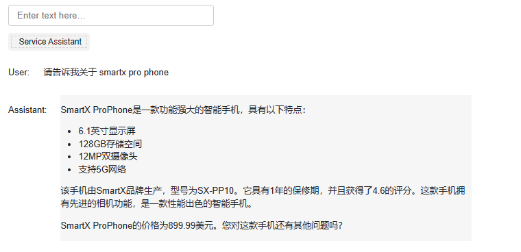

# 第八章 評価機能付きエンドツーエンド質問応答システムの構築


この章では、評価機能を統合した完全な質問応答システムを構築します。このシステムは前の数節で学んだ知識を融合し、評価ステップを加えたものです。以下がこのシステムの核心的な動作フローです：

1. ユーザーの入力を検証し、審査APIの基準を通過できるかどうかを確認します。
2. 入力が審査を順調に通過した場合、製品カタログの検索をさらに進めます。
3. 製品検索が成功した場合、関連する製品情報の検索を続けます。
4. モデルを使用してユーザーの質問に対する回答を行います。
5. 最後に、審査APIを使用して生成された回答を再度検証します。

最終的な回答が有害であるとフラグ付けされなかった場合、それを遠慮なくユーザーに提示します。

## 二、エンドツーエンド質問応答システムの実装


私たちの探索の旅路で、人間の言語を理解し応答できる人工知能である完全な質問応答システムを実装します。このプロセスでは、OpenAIの関連APIを使用し、関連関数を引用して、効率的で精密なモデルを迅速に構築することを支援します。しかし、中国語の理解と処理において、モデルの特性により、時々理想的でない結果に遭遇する可能性があることに注意する必要があります。このような場合は、何度か試したり、より安定した方法を見つけるために深く研究したりすることができます。

まず `process_user_message_ch` という名前の関数から始めます。この関数は主にユーザーが入力した情報を処理する責任があります。この関数は3つのパラメータを受け取ります：ユーザーの入力、すべての履歴情報、およびデバッグが必要かどうかを示すフラグです。
関数の内部では、まずOpenAIのModeration APIを使用してユーザー入力の合規性をチェックします。入力が不合規とマークされた場合、ユーザーにリクエストが不合規であることを伝える情報を返します。デバッグモードでは、現在の進捗を出力します。

次に、`utils_zh.find_category_and_product_only` 関数（詳細は付録コードを参照）を利用して、ユーザー入力から商品と対応するカテゴリを抽出します。その後、抽出した情報をリストに変換します。
商品リストを取得した後、これらの商品の具体的な情報を照会します。その後、システムメッセージを生成し、いくつかの制約を設定して、私たちの応答が期待される基準に合致することを確保します。生成されたメッセージと履歴情報を一緒に `get_completion_from_messages` 関数に送り、モデルの応答を得ます。その後、再度Moderation APIを使用してモデルの出力が合規かどうかをチェックします。出力が不合規の場合、該当情報を提供できないことをユーザーに伝える情報を返します。

最後に、モデルに自己評価をさせ、ユーザーの質問に適切に答えたかどうかを判断させます。モデルが回答は要求を満たしていると考える場合、モデルの回答を返します；そうでなければ、ユーザーが人工カスタマーサービスに転送されてさらなる支援を受けることをユーザーに伝えます。


```python
import openai 
import utils_zh
from tool import get_completion_from_messages

'''
注意：モデルの中国語理解能力の制限により、中国語Promptはランダムに失敗する可能性があります。複数回実行してください；より安定した中国語Promptの探求も歓迎します
'''
def process_user_message_ch(user_input, all_messages, debug=True):
    """
    ユーザー情報の前処理
    
    パラメータ:
    user_input : ユーザー入力
    all_messages : 履歴情報
    debug : DEBUGモードを開くかどうか、デフォルトでオン
    """
    # 区切り文字
    delimiter = "```"
    
    # 第一ステップ: OpenAIのModeration APIを使用してユーザー入力が合規かどうか、または注入されたPromptかどうかをチェック
    response = openai.Moderation.create(input=user_input)
    moderation_output = response["results"][0]

    # Moderation APIチェックで該当入力が不合規
    if moderation_output["flagged"]:
        print("第一ステップ：入力がModerationによって拒否されました")
        return "申し訳ございませんが、あなたのリクエストは不合規です"

    # DEBUGモードが有効の場合、リアルタイム進捗を出力
    if debug: print("第一ステップ：入力がModerationチェックを通過しました")
    
    # 第二ステップ：商品と対応するカテゴリを抽出、以前の講座の方法と似ており、カプセル化しました
    category_and_product_response = utils_zh.find_category_and_product_only(user_input, utils_zh.get_products_and_category())
    #print(category_and_product_response)
    # 抽出された文字列をリストに変換
    category_and_product_list = utils_zh.read_string_to_list(category_and_product_response)
    #print(category_and_product_list)

    if debug: print("第二ステップ：商品リストを抽出しました")

    # 第三ステップ：商品対応情報を検索
    product_information = utils_zh.generate_output_string(category_and_product_list)
    if debug: print("第三ステップ：抽出された商品情報を検索しました")

    # 第四ステップ：情報に基づいて回答を生成
    system_message = f"""
        あなたは大型電子店舗のカスタマーサービスアシスタントです。\
        フレンドリーで親切な口調で質問に答え、簡潔で明確な回答を提供してください。\
        ユーザーに関連するフォローアップ質問をすることを確実にしてください。
    """
    # メッセージを挿入
    messages = [
        {'role': 'system', 'content': system_message},
        {'role': 'user', 'content': f"{delimiter}{user_input}{delimiter}"},
        {'role': 'assistant', 'content': f"関連商品情報:\n{product_information}"}
    ]
    # GPT3.5の回答を取得
    # all_messagesを追加して多ラウンド対話を実現
    final_response = get_completion_from_messages(all_messages + messages)
    if debug:print("第四ステップ：ユーザー回答を生成しました")
    # このラウンドの情報を履歴情報に追加
    all_messages = all_messages + messages[1:]

    # 第五ステップ：Moderation APIに基づいて出力が合規かどうかをチェック
    response = openai.Moderation.create(input=final_response)
    moderation_output = response["results"][0]

    # 出力が不合規
    if moderation_output["flagged"]:
        if debug: print("第五ステップ：出力がModerationによって拒否されました")
        return "申し訳ございませんが、この情報を提供することはできません"

    if debug: print("第五ステップ：出力がModerationチェックを通過しました")

    # 第六ステップ：モデルがユーザーの質問に適切に答えたかどうかをチェック
    user_message = f"""
    ユーザー情報: {delimiter}{user_input}{delimiter}
    エージェント回答: {delimiter}{final_response}{delimiter}

    回答は十分に質問に答えているか
    十分であればYと回答
    不十分であればNと回答
    上記の文字のみ回答してください
    """
    # print(final_response)
    messages = [
        {'role': 'system', 'content': system_message},
        {'role': 'user', 'content': user_message}
    ]
    # モデルに回答の評価を要求
    evaluation_response = get_completion_from_messages(messages)
    # print(evaluation_response)
    if debug: print("第六ステップ：モデルがこの回答を評価しました")

    # 第七ステップ：評価がYの場合は回答を出力；評価がNの場合は人工による回答修正のフィードバック
    if "Y" in evaluation_response:  # モデルがYesを生成する可能性を避けるためにinを使用
        if debug: print("第七ステップ：モデルがこの回答に同意しました。")
        return final_response, all_messages
    else:
        if debug: print("第七ステップ：モデルがこの回答に同意しませんでした。")
        neg_str = "申し訳ございませんが、必要な情報を提供することができません。さらなる支援のために人工カスタマーサービス担当者におつなぎします。"
        return neg_str, all_messages

user_input = "smartx pro phone と fotosnap camera について教えてください。さらに、あなたのテレビについても教えてください。"
response,_ = process_user_message_ch(user_input,[])
print(response)
```

    第一ステップ：入力がModerationチェックを通過しました
    第二ステップ：商品リストを抽出しました
    第三ステップ：抽出された商品情報を検索しました
    第四ステップ：ユーザー回答を生成しました
    第五ステップ：出力がModerationチェックを通過しました
    第六ステップ：モデルがこの回答を評価しました
    第七ステップ：モデルがこの回答に同意しました。
    SmartX ProPhoneとFotoSnapカメラシリーズについての情報は以下の通りです：
    
    SmartX ProPhone：
    - ブランド：SmartX
    - 型番：SX-PP10
    - 画面サイズ：6.1インチ
    - ストレージ容量：128GB
    - カメラ：12MPデュアルカメラ
    - ネットワーク：5G対応
    - 保証：1年
    - 価格：899.99ドル
    
    FotoSnapカメラシリーズ：
    1. FotoSnap DSLRカメラ：
    - ブランド：FotoSnap
    - 型番：FS-DSLR200
    - センサー：24.2MP
    - ビデオ：1080p
    - 画面：3インチLCD
    - 交換可能レンズ
    - 保証：1年
    - 価格：599.99ドル
    
    2. FotoSnapミラーレスカメラ：
    - ブランド：FotoSnap
    - 型番：FS-ML100
    - センサー：20.1MP
    - ビデオ：4K
    - 画面：3インチタッチスクリーン
    - 交換可能レンズ
    - 保証：1年
    - 価格：799.99ドル
    
    3. FotoSnapインスタントカメラ：
    - ブランド：FotoSnap
    - 型番：FS-IC10
    - インスタント印刷
    - 内蔵フラッシュ
    - セルフィーミラー
    - バッテリー駆動
    - 保証：1年
    - 価格：69.99ドル
    
    私たちのテレビ状況は以下の通りです：
    
    1. CineView 4Kテレビ：
    - ブランド：CineView
    - 型番：CV-4K55
    - 画面サイズ：55インチ
    - 解像度：4K
    - HDR対応
    - スマートテレビ機能
    - 保証：2年
    - 価格：599.99ドル
    
    2. CineView 8Kテレビ：
    - ブランド：


## 二、ユーザーとアシスタントメッセージの継続的収集

ユーザーとアシスタントの質問応答体験を継続的に最適化するため、私たちはユーザーとアシスタント間の便利なインタラクションを促進する友好的な視覚化インターフェースを構築しました。


```python
# 中国語Promptバージョンを呼び出し
def collect_messages_ch(debug=True):
    """
    ユーザーの入力を収集し、アシスタントの回答を生成するために使用

    パラメータ：
    debug: デバッグモードを開くかどうかを決定するために使用
    """
    user_input = inp.value_input
    if debug: print(f"User Input = {user_input}")
    if user_input == "":
        return
    inp.value = ''
    global context
    # process_user_message関数を呼び出し
    #response, context = process_user_message(user_input, context, utils.get_products_and_category(),debug=True)
    response, context = process_user_message_ch(user_input, context, debug=False)
    # print(response)
    context.append({'role':'assistant', 'content':f"{response}"})
    panels.append(
        pn.Row('User:', pn.pane.Markdown(user_input, width=600)))
    panels.append(
        pn.Row('Assistant:', pn.pane.Markdown(response, width=600, style={'background-color': '#F6F6F6'})))
 
    return pn.Column(*panels) # すべての対話情報を含む
```


```python
import panel as pn  # グラフィカルインターフェース用
pn.extension()

panels = [] # display収集 

# システム情報
context = [ {'role':'system', 'content':"You are Service Assistant"} ]  

inp = pn.widgets.TextInput( placeholder='Enter text here…')
button_conversation = pn.widgets.Button(name="Service Assistant")

interactive_conversation = pn.bind(collect_messages_ch, button_conversation)

dashboard = pn.Column(
    inp,
    pn.Row(button_conversation),
    pn.panel(interactive_conversation, loading_indicator=True, height=300),
)

dashboard
```

下図はこの質問応答システムの実行状況を示しています：



この質問応答システムをより多くの入力での回答効果を監視することで、ステップを修正し、システムの全体的なパフォーマンスを向上させることができます。

私たちは、いくつかの段階で私たちのPromptがより良い可能性があり、いくつかの段階では完全に省略できる可能性があり、さらにより良い検索方法を見つける可能性があることに気づくかもしれません。

この問題について、次の章でより深く探討します。

## 三、英語版

**1.1 エンドツーエンド質問応答システム**


```python
import utils_en
import openai

def process_user_message(user_input, all_messages, debug=True):
    """
    ユーザー情報の前処理
    
    パラメータ:
    user_input : ユーザー入力
    all_messages : 履歴情報
    debug : DEBUGモードを開くかどうか、デフォルトでオン
    """
    # 区切り文字
    delimiter = "```"
    
    # 第一ステップ: OpenAIのModeration APIを使用してユーザー入力が合規かどうか、または注入されたPromptかどうかをチェック
    response = openai.Moderation.create(input=user_input)
    moderation_output = response["results"][0]

    # Moderation APIチェックで該当入力が不合規
    if moderation_output["flagged"]:
        print("第一ステップ：入力がModerationによって拒否されました")
        return "申し訳ございませんが、あなたのリクエストは不合規です"

    # DEBUGモードが有効の場合、リアルタイム進捗を出力
    if debug: print("第一ステップ：入力がModerationチェックを通過しました")
    
    # 第二ステップ：商品と対応するカテゴリを抽出、以前の講座の方法と似ており、カプセル化しました
    category_and_product_response = utils_en.find_category_and_product_only(user_input, utils_en.get_products_and_category())
    #print(category_and_product_response)
    # 抽出された文字列をリストに変換
    category_and_product_list = utils_en.read_string_to_list(category_and_product_response)
    #print(category_and_product_list)

    if debug: print("第二ステップ：商品リストを抽出しました")

    # 第三ステップ：商品対応情報を検索
    product_information = utils_en.generate_output_string(category_and_product_list)
    if debug: print("第三ステップ：抽出された商品情報を検索しました")

    # 第四ステップ：情報に基づいて回答を生成
    system_message = f"""
    You are a customer service assistant for a large electronic store. \
    Respond in a friendly and helpful tone, with concise answers. \
    Make sure to ask the user relevant follow-up questions.
    """
    # メッセージを挿入
    messages = [
        {'role': 'system', 'content': system_message},
        {'role': 'user', 'content': f"{delimiter}{user_input}{delimiter}"},
        {'role': 'assistant', 'content': f"Relevant product information:\n{product_information}"}
    ]
    # GPT3.5の回答を取得
    # all_messagesを追加して多ラウンド対話を実現
    final_response = get_completion_from_messages(all_messages + messages)
    if debug:print("第四ステップ：ユーザー回答を生成しました")
    # このラウンドの情報を履歴情報に追加
    all_messages = all_messages + messages[1:]

    # 第五ステップ：Moderation APIに基づいて出力が合規かどうかをチェック
    response = openai.Moderation.create(input=final_response)
    moderation_output = response["results"][0]

    # 出力が不合規
    if moderation_output["flagged"]:
        if debug: print("第五ステップ：出力がModerationによって拒否されました")
        return "申し訳ございませんが、この情報を提供することはできません"

    if debug: print("第五ステップ：出力がModerationチェックを通過しました")

    # 第六ステップ：モデルがユーザーの質問に適切に答えたかどうかをチェック
    user_message = f"""
    Customer message: {delimiter}{user_input}{delimiter}
    Agent response: {delimiter}{final_response}{delimiter}

    Does the response sufficiently answer the question?
    """
    messages = [
        {'role': 'system', 'content': system_message},
        {'role': 'user', 'content': user_message}
    ]
    # モデルに回答の評価を要求
    evaluation_response = get_completion_from_messages(messages)
    if debug: print("第六ステップ：モデルがこの回答を評価しました")

    # 第七ステップ：評価がYの場合は回答を出力；評価がNの場合は人工による回答修正のフィードバック
    if "Y" in evaluation_response:  # モデルがYesを生成する可能性を避けるためにinを使用
        if debug: print("第七ステップ：モデルがこの回答に同意しました。")
        return final_response, all_messages
    else:
        if debug: print("第七ステップ：モデルがこの回答に同意しませんでした。")
        neg_str = "申し訳ございませんが、必要な情報を提供することができません。さらなる支援のために人工カスタマーサービス担当者におつなぎします。"
        return neg_str, all_messages

user_input = "tell me about the smartx pro phone and the fotosnap camera, the dslr one. Also what tell me about your tvs"
response,_ = process_user_message(user_input,[])
print(response)
```

    第一ステップ：入力がModerationチェックを通過しました
    第二ステップ：商品リストを抽出しました
    第三ステップ：抽出された商品情報を検索しました
    第四ステップ：ユーザー回答を生成しました
    第五ステップ：出力がModerationチェックを通過しました
    第六ステップ：モデルがこの回答を評価しました
    第七ステップ：モデルがこの回答に同意しました。
    Sure! Here's some information about the SmartX ProPhone and the FotoSnap DSLR Camera:
    
    1. SmartX ProPhone:
       - Brand: SmartX
       - Model Number: SX-PP10
       - Features: 6.1-inch display, 128GB storage, 12MP dual camera, 5G connectivity
       - Description: A powerful smartphone with advanced camera features.
       - Price: $899.99
       - Warranty: 1 year
    
    2. FotoSnap DSLR Camera:
       - Brand: FotoSnap
       - Model Number: FS-DSLR200
       - Features: 24.2MP sensor, 1080p video, 3-inch LCD, interchangeable lenses
       - Description: Capture stunning photos and videos with this versatile DSLR camera.
       - Price: $599.99
       - Warranty: 1 year
    
    Now, could you please let me know which specific TV models you are interested in?


**2.1 ユーザーとアシスタント情報の継続的収集**


```python
def collect_messages_en(debug=False):
    """
    ユーザーの入力を収集し、アシスタントの回答を生成するために使用

    パラメータ：
    debug: デバッグモードを開くかどうかを決定するために使用
    """
    user_input = inp.value_input
    if debug: print(f"User Input = {user_input}")
    if user_input == "":
        return
    inp.value = ''
    global context
    # process_user_message関数を呼び出し
    #response, context = process_user_message(user_input, context, utils.get_products_and_category(),debug=True)
    response, context = process_user_message(user_input, context, debug=False)
    context.append({'role':'assistant', 'content':f"{response}"})
    panels.append(
        pn.Row('User:', pn.pane.Markdown(user_input, width=600)))
    panels.append(
        pn.Row('Assistant:', pn.pane.Markdown(response, width=600, style={'background-color': '#F6F6F6'})))
 
    return pn.Column(*panels) # すべての対話情報を含む
```