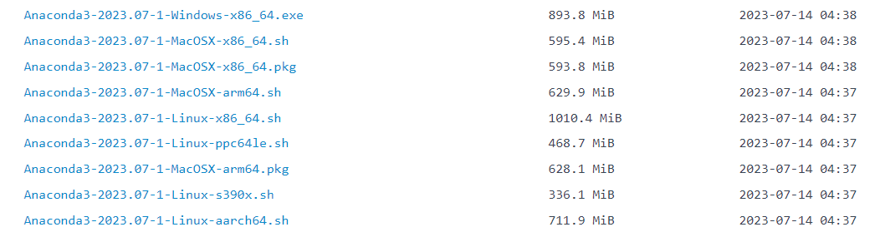
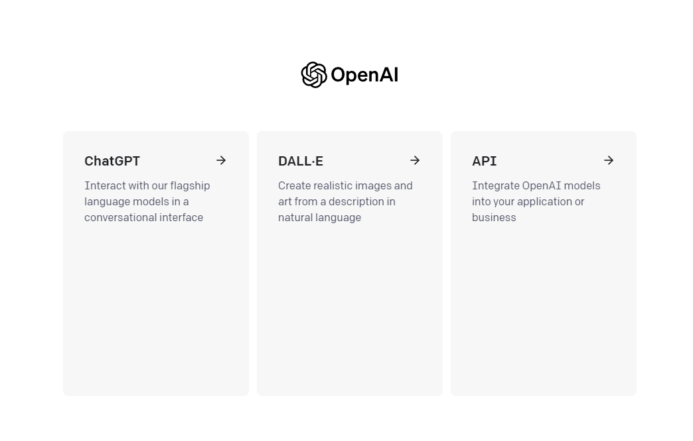

# 環境設定

本章では、このチュートリアルを読むために必要な環境の設定方法を紹介します。これには、Python、Jupyter Notebook、OpenAI APIキー、本書のコードを実行するために必要な関連ライブラリが含まれます。

以下の環境設定には、一度だけ設定すればよいもの（Python、Jupyter Notebookなど）と、コードを再現するたびに設定が必要なもの（OpenAI APIキーの設定など）があることにご注意ください。

## 一、Anacondaのインストール

公式サイトからのインストールは遅いため、[清華大学のミラー](https://mirrors.tuna.tsinghua.edu.cn/anaconda/archive)からAnacondaをインストールすることができます。

<p align="center">
  
</p>

対応するバージョンを選択してダウンロード・インストールしてください。


すでにAnacondaがインストールされている場合は、以下の手順をスキップできます。

- Windowsシステムを使用している場合は、`Anaconda3-2023.07-1-Windows-x86_64.exe`インストールパッケージをダウンロードして直接インストールできます。

- MacOSシステムを使用している場合
    1. Intelチップ：`Anaconda3-2023.07-1-MacOSX-x86_64.sh`をダウンロード
    2. Appleチップ：`Anaconda3-2023.07-1-MacOSX-arm64.sh`をダウンロード
    そして以下の操作を実行します：


```python
# Intelプロセッサを例に、ファイル名は変更される可能性があります
sh Anaconda3-2023.07-1-MacOSX-x86_64.sh -b
```

次に、ターミナルShellを初期化して、condaを直接実行できるようにします。


```python
~/anaconda3/bin/conda init
```

現在のシェルを閉じて再度開くと、コマンドラインの前に`(base)`が表示されます。これはanacondaの基本的な`python`環境です。次に、以下のコマンドを使用して新しい環境を作成します：


```python
# chatgptという名前でpythonバージョン3.9の環境を作成
conda create --name chatgpt python=3.9 -y
```

作成が完了したら、chatgpt環境をアクティベートします：


```python
conda activate chatgpt
```

## 二、本書で使用するPythonライブラリのインストール


```python
!pip install -q python-dotenv
!pip install -q openai
## その他のpythonパッケージ
```

## 三、OpenAI APIキーの取得と設定

OpenAI APIキーを取得する前に、[OpenAI公式サイト](https://openai.com/)でアカウントを登録する必要があります。ここでは、すでにOpenAIアカウントを持っていると仮定し、まず[OpenAI公式サイト](https://openai.com/)にログインします。ログイン後は以下のような画面になります：

<p align="center">
  
</p>

`API`を選択し、右上のアバターをクリックして`View API keys`を選択します。以下の画面が表示されます：

<p align="center">
  
</p>

`Create new secret key`ボタンをクリックしてOpenAI APIキーを作成し、作成したOpenAI APIキーをコピーして`OPENAI_API_KEY="sk-..."`の形式で`.env`ファイルに保存し、`.env`ファイルをプロジェクトのルートディレクトリに保存します。# TODO:固定位置の確認待ち

以下は`.env`ファイルを読み込むコードです


```python
import os
import openai
from dotenv import load_dotenv, find_dotenv

# ローカル/プロジェクトの環境変数を読み込む

# find_dotenv()は.envファイルのパスを検索して特定する
# load_dotenv()はその.envファイルを読み込み、その中の環境変数を現在の実行環境にロードする
# グローバル環境変数を設定している場合、このコード行は何の効果もありません。
_ = load_dotenv(find_dotenv())

# 環境変数 OPENAI_API_KEY を取得
openai.api_key = os.environ['OPENAI_API_KEY']
```

`.env`ファイルを読み込むコードを関数としてカプセル化し、各章で直接呼び出してOpenAI APIキーを取得できるようにします。


```python
import os
from dotenv import load_dotenv, find_dotenv
def get_openai_key():
    _ = load_dotenv(find_dotenv())
    return os.environ['OPENAI_API_KEY']

openai.api_key = get_openai_key()
```